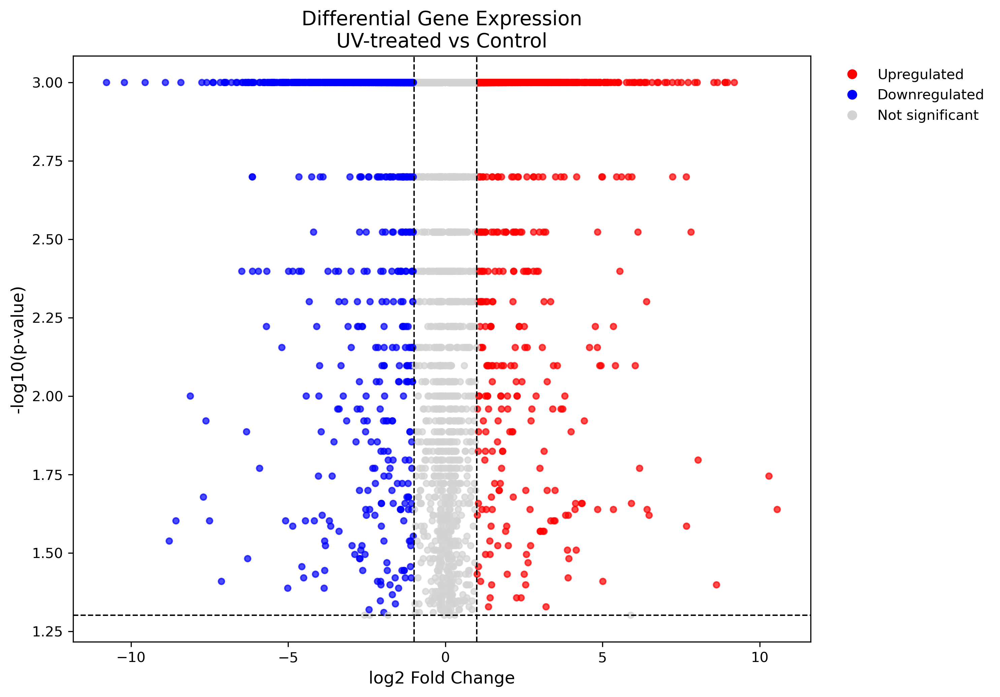
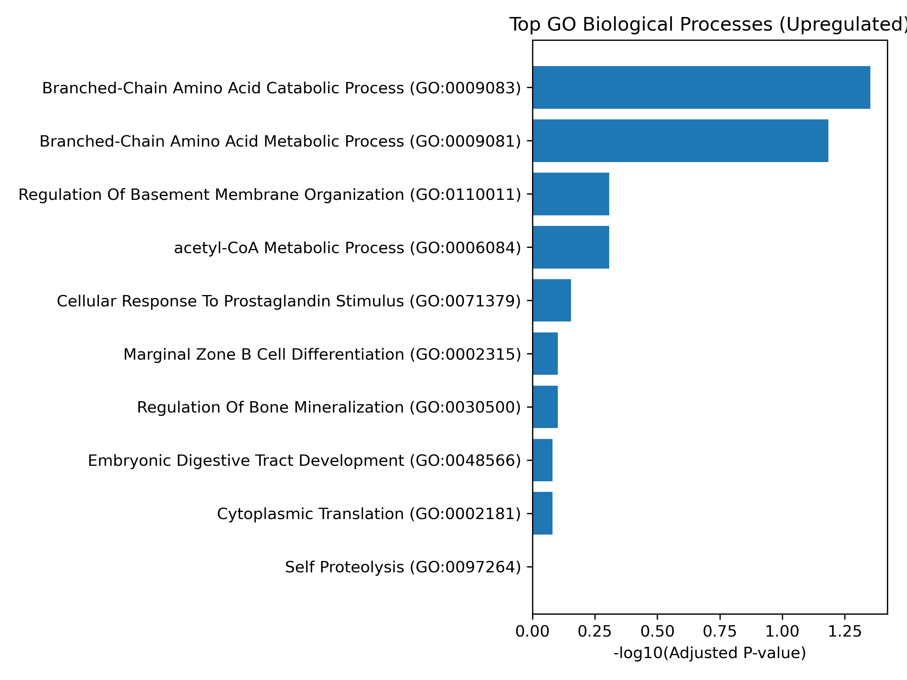
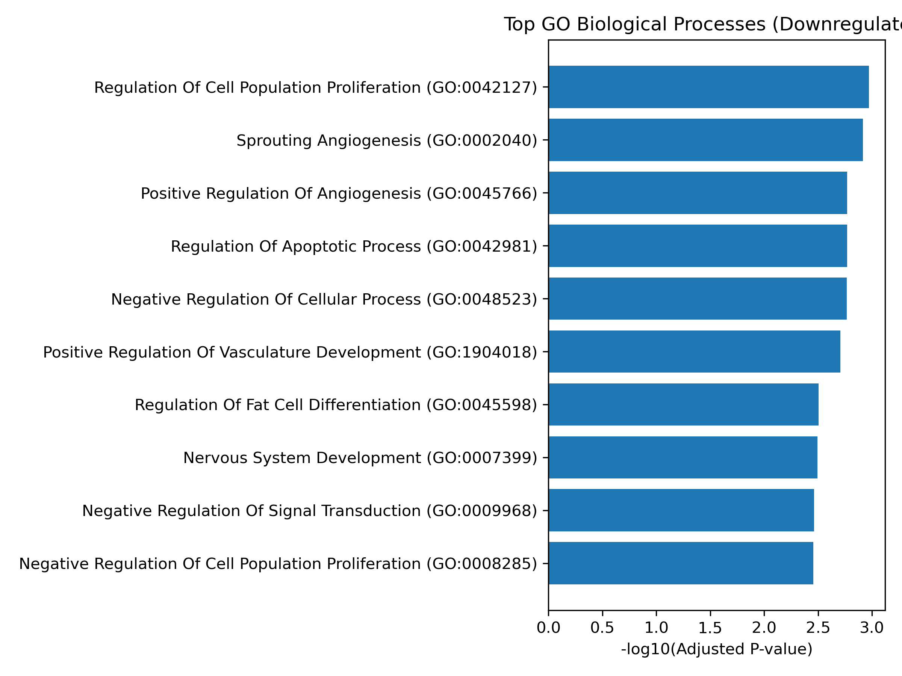
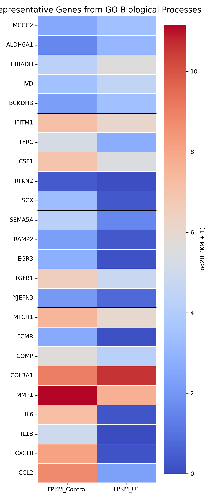

# UV Transcriptomic Analysis

Python-based RNA-seq analysis of UV-induced transcriptomic changes in human dermal fibroblasts.

---

# Project Overview

Ultraviolet (UV) radiation is a major environmental factor contributing to skin aging by inducing widespread molecular changes in dermal fibroblasts. While many transcriptomic studies focus on identifying individual differentially expressed genes (DEGs), biological responses arise from coordinated regulation of multiple pathways rather than isolated genes.

This project applies differential gene expression analysis and Gene Ontology (GO) enrichment to investigate biological processes altered by UV exposure from a systems biology perspective.

**Key Skills**

- Python
- RNA-seq analysis
- Differential Gene Expression (DEG)
- Gene Ontology (GO) enrichment
- Data visualization
- Systems Biology
---

# Research Question

**Which coordinated biological processes are altered in UV-exposed human dermal fibroblasts, and do these transcriptomic changes reflect chronic photoaging or an acute UV stress response?**

---

# Dataset

- **Source:** NCBI Gene Expression Omnibus (GEO)
- **Accession:** GSE119009
- **Cell type:** Normal Human Dermal Fibroblasts (NHDF)
- **Comparison:** UV-treated vs Control

---

# Workflow

RNA-seq data

↓

Differential Gene Expression (DEG) Analysis

↓

Volcano Plot

↓

GO Biological Process Enrichment

↓

Representative Gene Selection

↓

Heatmap & Biological Process Comparison

---

# Methods

Analysis included:

- Differential expression analysis
- Volcano plot visualization
- GO Biological Process enrichment
- Representative gene heatmap
- Biological process comparison (boxplot)

- Python
- Pandas
- NumPy
- Matplotlib
- Seaborn
- GSEAPY (GO enrichment)

---

# Results

## Differential Gene Expression

UV exposure induced widespread transcriptomic alterations, with both significantly upregulated and downregulated genes identified under the selected significance thresholds.

## GO Biological Process Enrichment

### Upregulated Biological Processes

### Downregulated Biological Processes

GO enrichment analysis revealed coordinated changes in biological processes rather than isolated gene-level alterations. Upregulated genes were primarily associated with metabolic pathways, whereas downregulated genes were enriched in biological processes related to proliferation, angiogenesis, and apoptosis.

## Representative Gene Expression

Representative genes from enriched biological processes displayed consistent expression patterns across functional categories, supporting pathway-level interpretation of UV-induced transcriptomic responses.

---

## GO Biological Process Enrichment

GO enrichment revealed coordinated transcriptomic changes rather than isolated gene-level alterations.

Major enriched biological processes included:

- Branched-chain amino acid metabolism
- Cell population proliferation
- Angiogenesis
- Regulation of apoptotic processes

---

## Systems-Level Interpretation

Instead of interpreting transcriptomic responses through individual genes, this analysis examined coordinated changes across biological processes. Integrating differential expression analysis with GO enrichment enabled pathway-level interpretation of UV-induced responses, illustrating how multiple biological functions are collectively reorganized following UV exposure.

---

# Limitations

- Single RNA-seq dataset
- Single post-irradiation time point
- GO enrichment identifies statistically enriched biological processes but does not establish causal regulatory relationships.

---

# Future Work

Potential future extensions include:

- Time-course RNA-seq analysis
- Single-cell RNA-seq
- Gene regulatory network analysis
- Pathway network modeling

---
